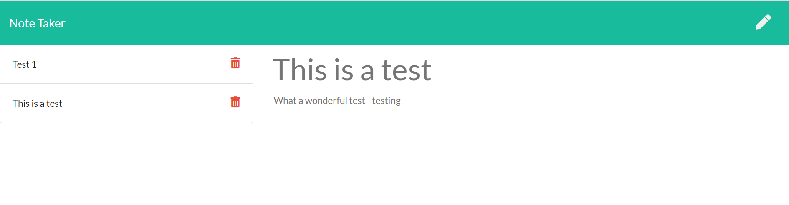

# 11 express-notetaker

## Description

This application is a simple note taking application. It allows the user to take, delete and amend notes.

The technologies used to create the application include:

- Javascript
- Node.js
- Express.js
- Heroku

## Instructions

Once you've cloned the repository from GitHub, you'll want to open the file server.js and open in the Terminal. You will run "npm install" and once the node_modules have been installed, you'll be able to run the server.js file.

## Deployment

This application has been deployed across Heroku, you can view this here: https://vast-coast-38296.herokuapp.com/

## Preview of Application

Below is a preview of the deployed application

